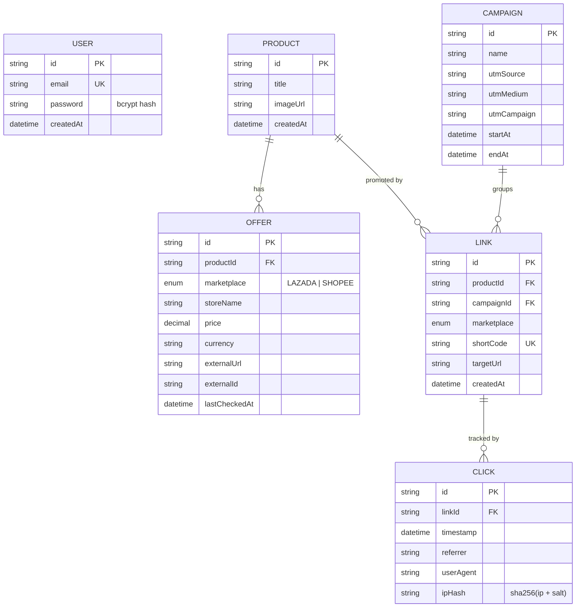
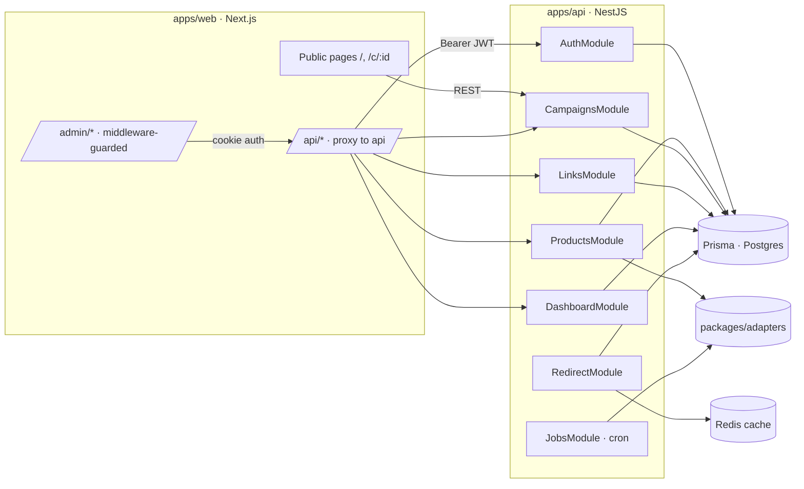
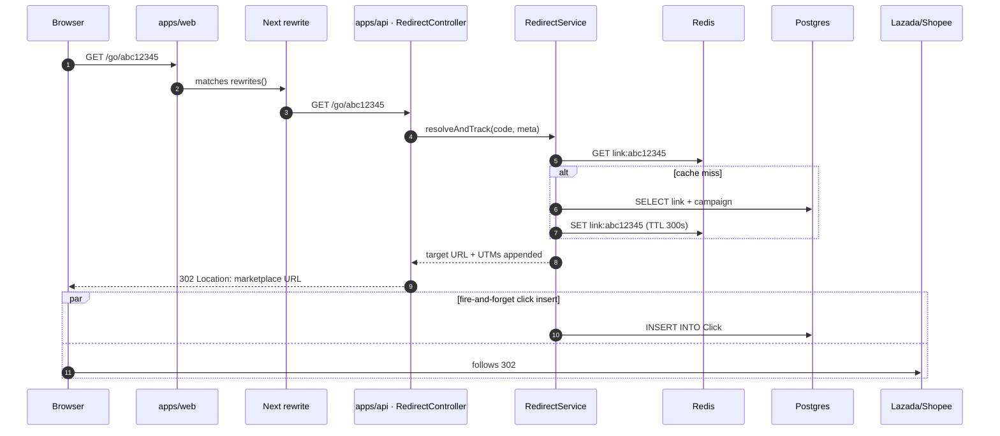
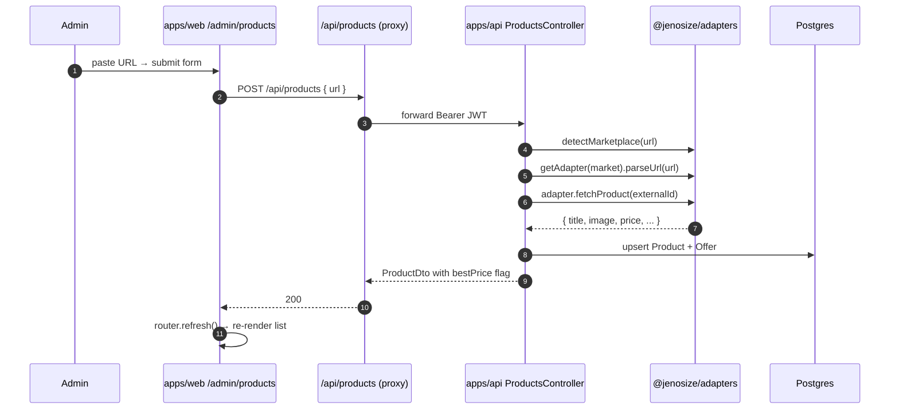

# Architecture

This document expands on the [README architecture overview](../README.md#architecture) with sequence diagrams, request lifecycles, and the smoke-test checklist.

---

## Data model (ER diagram)

> The unique `(productId, marketplace)` index on `Offer` and
> `(productId, campaignId, marketplace)` on `Link` keep the model
> idempotent: re-adding the same product or generating the same link
> upserts in place instead of creating duplicates.

---

## Module dependency graph

---

## Redirect lifecycle (hot path)

**Why this design:**
- Cache TTL is 5 min — short enough to pick up campaign UTM changes; long enough to amortize cold lookups.
- Click insert is `setImmediate`-deferred: a slow DB write never blocks the user's redirect.
- **Open-redirect defense**: even if a malicious targetUrl somehow landed in the DB, `appendUtm` rejects any host that isn't a Lazada/Shopee suffix.

---

## Add product flow (admin)

---

## Smoke test (post-deploy)

After deploying to Railway, walk through this checklist on the public URLs:

- [ ] **API health** — `GET <api>/health` returns `{status:"ok"}`
- [ ] **Swagger** — `<api>/api/docs` loads with all 13 endpoints
- [ ] **Login** — `<web>/admin/login` with seeded credentials redirects to `/admin/dashboard`
- [ ] **Add product** (Lazada) — paste `https://www.lazada.co.th/products/matcha-001.html` → row appears with offer
- [ ] **Add product** (Shopee) — paste `https://shopee.co.th/product/123456/matcha-001` → second offer appears on same product, **Best price** badge moves to whichever is cheaper
- [ ] **Create campaign** "Summer Deal 2025" with UTM `summer_deal_2025`
- [ ] **Generate link** — Lazada and Shopee shortcodes produced
- [ ] **Public landing** — `<web>/c/:id` shows product card with both prices and CTAs
- [ ] **Click CTA** — opens marketplace URL with `utm_source=jenosize&utm_medium=affiliate&utm_campaign=summer_deal_2025`
- [ ] **Dashboard** — `<web>/admin/dashboard` totalClicks increments; bar chart for "today" non-zero
- [ ] **Top products** — leaderboard shows the product just clicked
- [ ] **Cron** — wait one tick (or use a manual trigger in dev) → `Offer.lastCheckedAt` advances
- [ ] **Logout** — cookie cleared; `/admin/dashboard` redirects to `/admin/login?next=...`

If every box is ticked, the submission is functionally complete.
